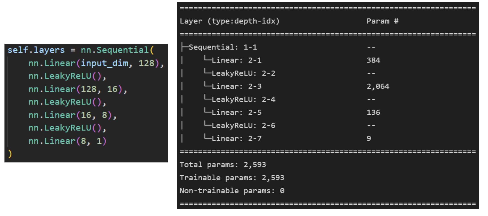
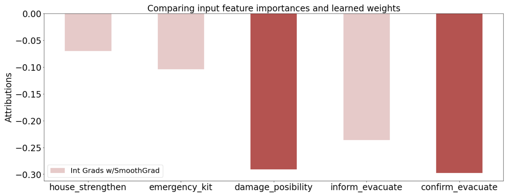
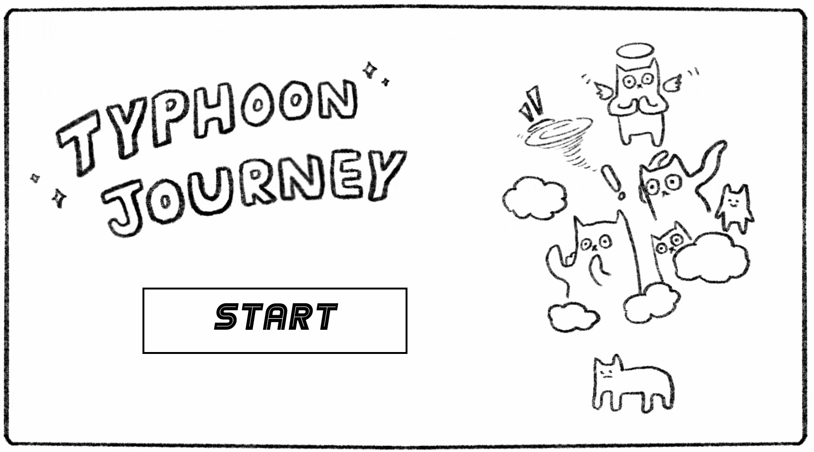

# Typhoon Survival Prediction - Educational Web Game


**🎮 Play the Official Game:** [https://easy2do.ncdr.nat.gov.tw/tyready/](https://easy2do.ncdr.nat.gov.tw/tyready/)  
*Published by NCDR-Taiwan (National Science and Technology Center for Disaster Reduction)*

**🎯 Try the Prototype:** [https://caslowchien.github.io/Typhoon-Survival-Prediction_Educational-WebGame/](https://caslowchien.github.io/Typhoon-Survival-Prediction_Educational-WebGame/)

---

## 📋 Overview

This project is a data-driven disaster education web game developed for the Taiwanese government. It uses machine learning to predict typhoon survival outcomes based on household prevention behaviors, helping citizens understand which safety measures are most effective during natural disasters.

The prototype won the **"Most Popular Award"** at the MVP demo day and secured a government contract to build the full production version now deployed by Taiwan's National Science and Technology Center for Disaster Reduction.

---

## ✨ Key Features

- **AI-Powered Predictions**: Deep neural network trained on real post-typhoon household survey data
- **Interactive Learning**: Engaging web-based game format that teaches disaster preparedness
- **Data-Driven Insights**: Analysis of 256 population groups to identify critical prevention behaviors
- **High Accuracy**: ~80% prediction accuracy using PyTorch-based neural network
- **Proven Impact**: 70% increase in user engagement compared to traditional educational materials

---

## 🛠️ Technical Stack

**Machine Learning & Data Science:**
- Python (Pandas, PyTorch)
- Deep Neural Network (DNN) architecture
- Data mining and statistical analysis

**Web Development:**
- HTML5
- CSS3
- JavaScript

---

## 🧠 Machine Learning Model


*Deep Neural Network Structure*

The prediction model was built using:
- **Dataset**: Post-typhoon household survey data from Social Impacts and Recovery Survey of Typhoon Morakot (2010-2019)
- **Source**: [NCDR Disaster Statistics Platform](https://drrstat.ncdr.nat.gov.tw/)
- **Architecture**: Self-built deep neural network using PyTorch
- **Performance**: ~80% classification accuracy
- **Population Groups**: 256 distinct demographic classifications

### Model Interpretability


*Integrated Gradients with SmoothGrad for model explainability*

The model uses Explainable AI techniques to identify which prevention behaviors have the strongest impact on survival outcomes, with statistical significance at 99% confidence level for both linear and non-linear relationships.

---

## 📊 Results


*Example of survival prediction results*

The game provides personalized survival rate predictions based on users' selected prevention actions, helping them understand the real-world impact of disaster preparedness measures.

---

## 🎮 How to Use


*Prototype game interface (this repository)*

### Playing the Game:
1. Visit the [official game link](https://easy2do.ncdr.nat.gov.tw/tyready/) or try the [prototype version](https://caslowchien.github.io/Typhoon-Survival-Prediction_Educational-WebGame/)
2. Select your household characteristics and prevention behaviors
3. Receive an AI-powered survival prediction
4. Learn which actions most improve your safety during typhoons

### Running Locally:
1. Clone this repository
```bash
git clone https://github.com/caslowchien/Typhoon-Survival-Prediction_Educational-WebGame.git
```
2. Open `p01.html` in your web browser to start the game

---

## 🔬 Data Analysis Methodology

1. **Data Collection**: Post-typhoon household survey responses
2. **Data Cleaning**: Processed with Pandas for consistency and quality
3. **Statistical Analysis**: Identified prevention actions with strong positive correlations to survival rates
4. **Model Training**: Built and trained DNN using PyTorch
5. **Validation**: Achieved 80% accuracy with 99% confidence intervals
6. **Deployment**: Integrated model into interactive web game

---

## 🏆 Project Impact

- **Award**: Most Popular Award at MVP Demo Day
- **Engagement**: 70% increase in user engagement vs. traditional educational materials
- **Recognition**: Secured government contract for full production version
- **Deployment**: Currently live and serving Taiwanese citizens through NCDR

---

## 📝 Project Context

This repository contains the **prototype version** of the game. The official production version with enhanced features is deployed at [https://easy2do.ncdr.nat.gov.tw/tyready/](https://easy2do.ncdr.nat.gov.tw/tyready/) and maintained by the National Science and Technology Center for Disaster Reduction.

---

## 📚 Data Source

Social Impacts and Recovery Survey of Typhoon Morakot (2010-2019)  
Available at: [https://drrstat.ncdr.nat.gov.tw/](https://drrstat.ncdr.nat.gov.tw/)

---

## 🤝 Team & Leadership

Led a cross-functional team combining data science, web development, and disaster education expertise to deliver an engaging and scientifically rigorous educational tool.

---

## 📄 License

This project was developed under contract with the Taiwanese government. Please contact NCDR for licensing information regarding the official version.

---

## 🙋 Questions or Feedback?

For questions about the prototype or technical implementation, please open an issue in this repository.  
For questions about the official game, please contact [NCDR-Taiwan](https://www.ncdr.nat.gov.tw/).
